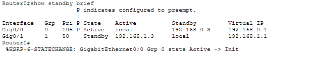
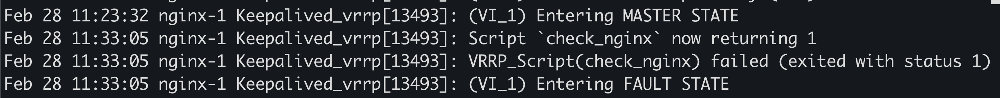
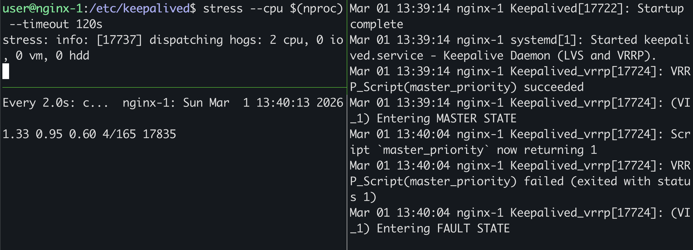
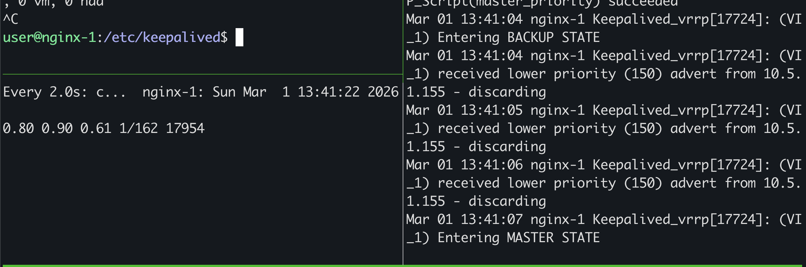
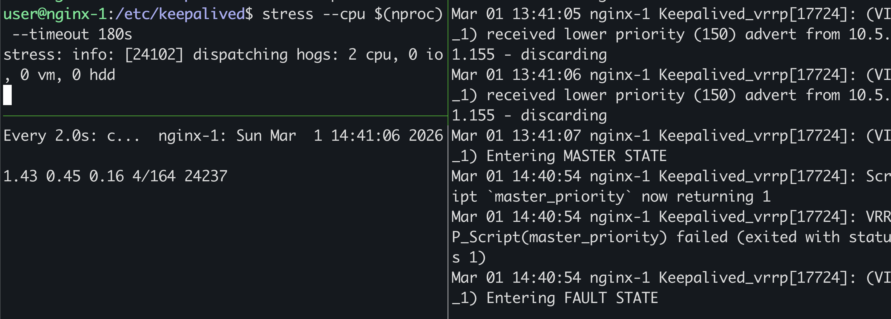
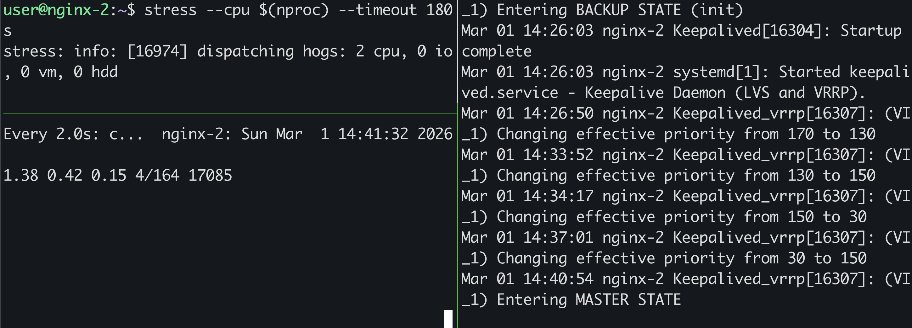
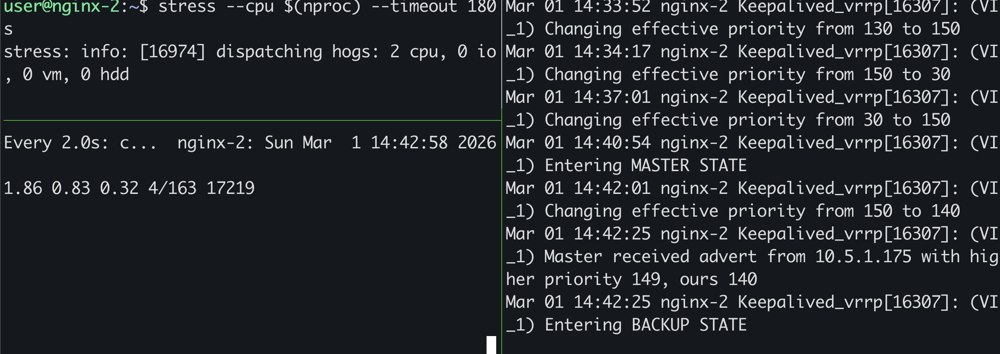

# Домашнее задание к занятию 1 «Disaster recovery и Keepalived», Сергеев Дмитрий
### Задание 1
- Дана [схема](1/hsrp_advanced.pkt) для Cisco Packet Tracer, рассматриваемая в лекции.
- На данной схеме уже настроено отслеживание интерфейсов маршрутизаторов Gi0/1 (для нулевой группы)
- Необходимо аналогично настроить отслеживание состояния интерфейсов Gi0/0 (для первой группы).
- Для проверки корректности настройки, разорвите один из кабелей между одним из маршрутизаторов и Switch0 и запустите ping между PC0 и Server0.
- На проверку отправьте получившуюся схему в формате pkt и скриншот, где виден процесс настройки маршрутизатора.

### Задание 1
Либо в файле уже все было настроено, либо я что-то не понял. Но глобально делал бы:
```
enable
config
interface g0/0
astandby version 2
standby 0 ip 192.168.0.1
standby 0 priority 100
standby 0 preempt
```




------


### Задание 2
- Запустите две виртуальные машины Linux, установите и настройте сервис Keepalived как в лекции, используя пример конфигурационного [файла](1/keepalived-simple.conf).
- Настройте любой веб-сервер (например, nginx или simple python server) на двух виртуальных машинах
- Напишите Bash-скрипт, который будет проверять доступность порта данного веб-сервера и существование файла index.html в root-директории данного веб-сервера.
- Настройте Keepalived так, чтобы он запускал данный скрипт каждые 3 секунды и переносил виртуальный IP на другой сервер, если bash-скрипт завершался с кодом, отличным от нуля (то есть порт веб-сервера был недоступен или отсутствовал index.html). Используйте для этого секцию vrrp_script
- На проверку отправьте получившейся bash-скрипт и конфигурационный файл keepalived, а также скриншот с демонстрацией переезда плавающего ip на другой сервер в случае недоступности порта или файла index.html
### Ответ 2

- [keepalived.conf](./task-02/keepalived.conf)
- [check_nginx.sh](./task-02/check_nginx.sh)





------

## Дополнительные задания со звёздочкой*

Эти задания дополнительные. Их можно не выполнять. На зачёт это не повлияет. Вы можете их выполнить, если хотите глубже разобраться в материале.
 
### Задание 3*
- Изучите дополнительно возможность Keepalived, которая называется vrrp_track_file
- Напишите bash-скрипт, который будет менять приоритет внутри файла в зависимости от нагрузки на виртуальную машину (можно разместить данный скрипт в cron и запускать каждую минуту). Рассчитывать приоритет можно, например, на основании Load average.
- Настройте Keepalived на отслеживание данного файла.
- Нагрузите одну из виртуальных машин, которая находится в состоянии MASTER и имеет активный виртуальный IP и проверьте, чтобы через некоторое время она перешла в состояние SLAVE из-за высокой нагрузки и виртуальный IP переехал на другой, менее нагруженный сервер.
- Попробуйте выполнить настройку keepalived на третьем сервере и скорректировать при необходимости формулу так, чтобы плавающий ip адрес всегда был прикреплен к серверу, имеющему наименьшую нагрузку.
- На проверку отправьте получившийся bash-скрипт и конфигурационный файл keepalived, а также скриншоты логов keepalived с серверов при разных нагрузках

### Ответ 3*
На мастере был использован track_script, т.к. нет возможности использовать вес и смысл в track_file отпадает.
```log
Keepalived_vrrp[16427]: (VI_1) ignoring tracked file priority_drop with weight -10 due to address_owner
```
Для более точного выполнения задания с тремя серверами будет достаточно что-то вроде:
```bash
#!/bin/bash
LOADAVG=$(awk '{ print int($1 * 100) }' /proc/loadavg)
echo $LOADAVG > /etc/keepalived/loadavg.txt
```
```log
track_file loadavg {
    file /etc/keepalived/loadavg.txt
    weight -1
}
```

Скрипты и конфиги MASTER:
- [master.sh](./task-03/master/master.sh)
- [keepalived.conf](./task-03/master/keepalived.conf)

Скрипты и конфиги BACKUP:
- [master.sh](./task-03/backup/backup.sh)
- [keepalived.conf](./task-03/backup/keepalived.conf)
### Ответ 3.1 Нагружен только мастер



### Ответ 3.2 Нагружены мастер и первый бэкап




