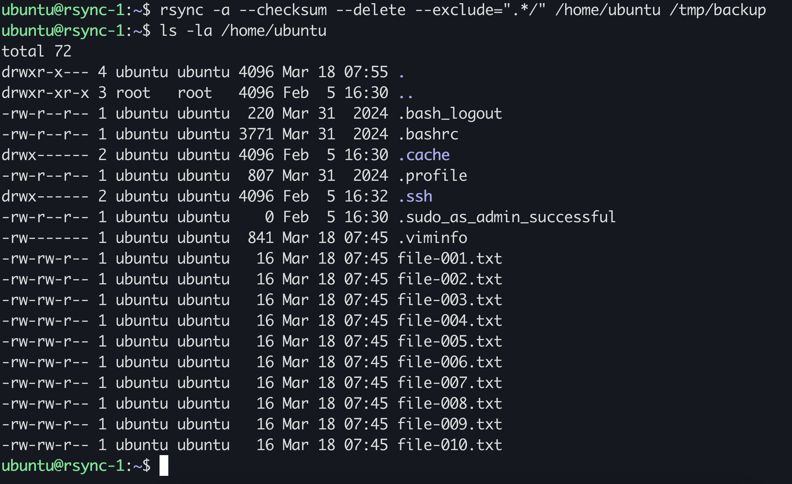
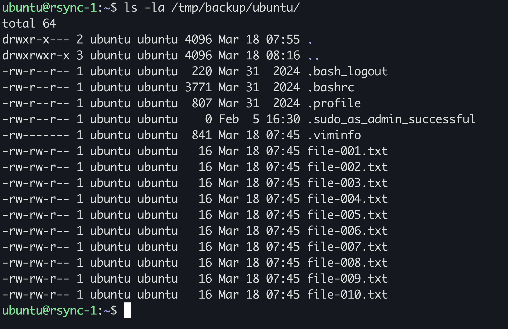
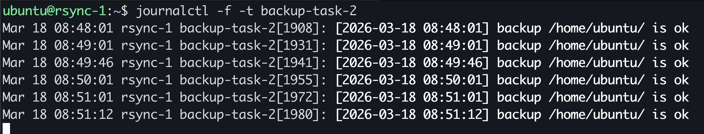
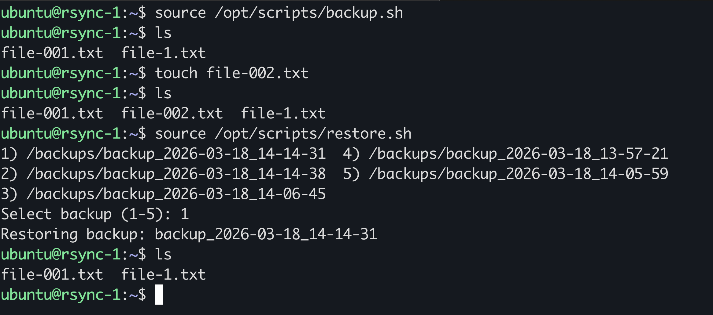

# Домашнее задание к занятию 3 «Резервное копирование», Сергеев Дмитрий

### Задание 1
- Составьте команду rsync, которая позволяет создавать зеркальную копию домашней директории пользователя в директорию `/tmp/backup`
- Необходимо исключить из синхронизации все директории, начинающиеся с точки (скрытые)
- Необходимо сделать так, чтобы rsync подсчитывал хэш-суммы для всех файлов, даже если их время модификации и размер идентичны в источнике и приемнике.
- На проверку направить скриншот с командой и результатом ее выполнения

### Ответ 1
```bash
rsync -a --checksum --delete --exclude=".*/" /home/ubuntu /tmp/backup
```



---

### Задание 2
- Написать скрипт и настроить задачу на регулярное резервное копирование домашней директории пользователя с помощью rsync и cron.
- Резервная копия должна быть полностью зеркальной
- Резервная копия должна создаваться раз в день, в системном логе должна появляться запись об успешном или неуспешном выполнении операции
- Резервная копия размещается локально, в директории `/tmp/backup`
- На проверку направить файл crontab и скриншот с результатом работы утилиты.

### Ответ 2
### backup shell script
[backup shell script](./assets/backup.sh)
```bash
#!/bin/bash
SOURCE="/home/ubuntu/"
DEST="/tmp/backup"
DATE=$(date '+%Y-%m-%d %H:%M:%S')
rsync -a --delete "${SOURCE}" "${DEST}" 2> /dev/null
RSYNC_STATUS=$?
if [ $RSYNC_STATUS -eq 0 ]; then
    logger -t 'backup-task-2' "[${DATE}] backup ${SOURCE} is ok"
else
    logger -t 'backup-task-2' "[${DATE}] backup ${SOURCE} failed"
fi
```
### crontab
```bash
0 0 * * * /home/ubuntu/backup.sh
```

---

## Задания со звёздочкой*
Эти задания дополнительные. Их можно не выполнять. На зачёт это не повлияет. Вы можете их выполнить, если хотите глубже разобраться в материале.

---

### Задание 3*
- Настройте ограничение на используемую пропускную способность rsync до 1 Мбит/c
- Проверьте настройку, синхронизируя большой файл между двумя серверами
- На проверку направьте команду и результат ее выполнения в виде скриншота

### Ответ 3*
```bash
rsync ... --bwlimit=1000
```
---
### Задание 4*
- Напишите скрипт, который будет производить инкрементное резервное копирование домашней директории пользователя с помощью rsync на другой сервер
- Скрипт должен удалять старые резервные копии (сохранять только последние 5 штук)
- Напишите скрипт управления резервными копиями, в нем можно выбрать резервную копию и данные восстановятся к состоянию на момент создания данной резервной копии.
- На проверку направьте скрипт и скриншоты, демонстрирующие его работу в различных сценариях.

### Ответ 4*

### backup.sh
```bash
#!/bin/bash
SOURCE="/home/localuser/"
REMOTE_USER="remote"
REMOTE_HOST="192.168.0.1"
REMOTE_BASE_DIR="/backups"
MAX_BACKUPS=5
DATE=$(date '+%Y-%m-%d_%H-%M-%S')
CURRENT_BACKUP="${REMOTE_BASE_DIR}/backup_$DATE"

ssh ${REMOTE_USER}@${REMOTE_HOST} "mkdir -p ${CURRENT_BACKUP}"
PREV_BACKUP=$(ssh ${REMOTE_USER}@${REMOTE_HOST} ls -1dt "${REMOTE_BASE_DIR}"/backup_* | head -n1)
if [[ -z "${PREV_BACKUP}" ]]; then
	rsync -az --delete -e ssh "${SOURCE}" "${REMOTE_USER}@${REMOTE_HOST}:${CURRENT_BACKUP}/"
else
	rsync -az --delete --link-dest="${PREV_BACKUP}" -e ssh "${SOURCE}" "${REMOTE_USER}@${REMOTE_HOST}:${CURRENT_BACKUP}/"
fi
ssh ${REMOTE_USER}@${REMOTE_HOST} "ls -1dt ${REMOTE_BASE_DIR}/backup_* | tail -n +$((MAX_BACKUPS + 1)) | xargs -r rm -rf"
```
### restore.sh
```bash
#!/bin/bash
REMOTE_USER="remote"
REMOTE_HOST="192.168.0.1"
REMOTE_BASE_DIR="/backups"
DEST_DIR="/home/localuser"

BACKUPS_LIST=$(ssh ${REMOTE_USER}@${REMOTE_HOST} ls -1dt "${REMOTE_BASE_DIR}"/backup_*)
PS3="Select backup (1-5): "
select BACKUP in ${BACKUPS_LIST[@]}; do
	if [[ -z $BACKUP ]]; then
		echo -e "\nIncorrect backup selected\n"
		continue
	fi
	echo -e "Restoring backup: $(basename ${BACKUP})";
	break;
done
rsync -az --delete -e ssh ${REMOTE_USER}@${REMOTE_HOST}:"${BACKUP}/" "${DEST_DIR}/"
```
